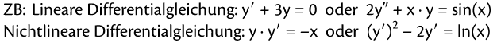
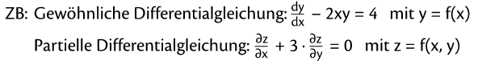
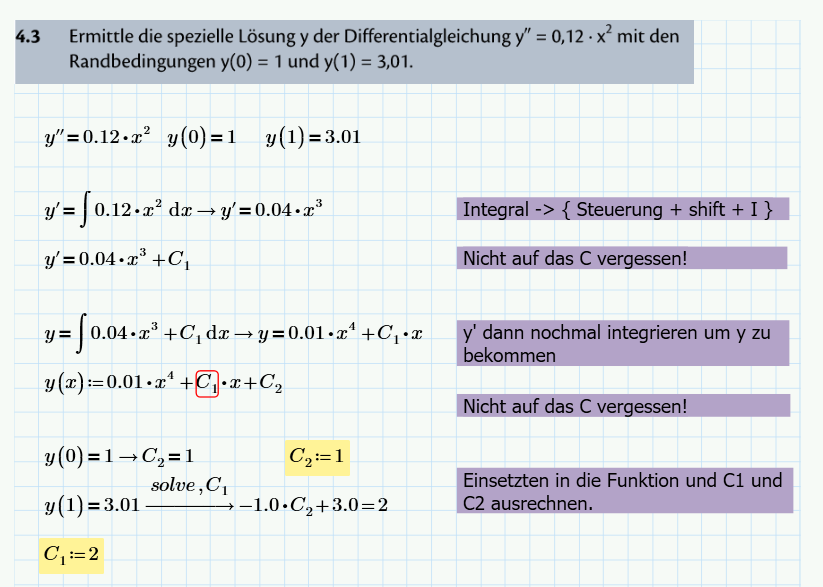
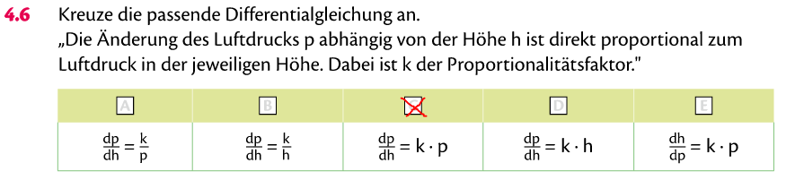
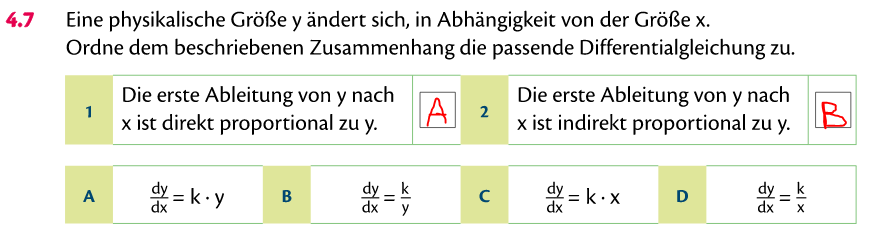
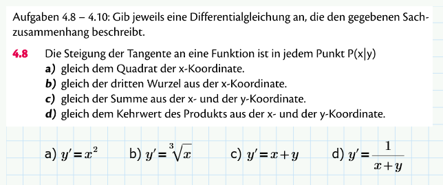
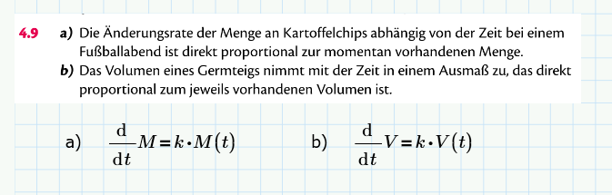
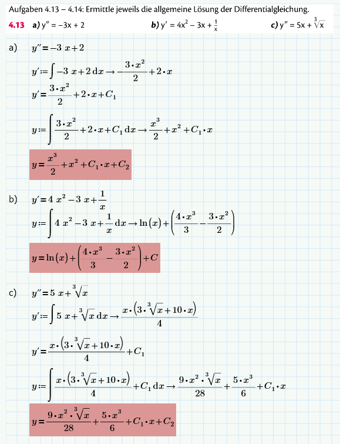
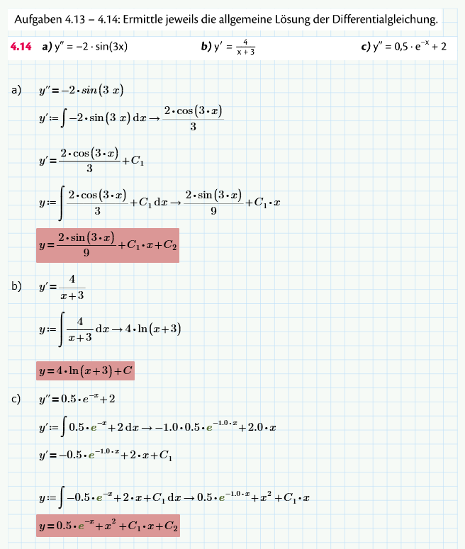

= Zweite Mathe Schularbeit

== Stoff

* Differentialgleichung

== Differentialgleichung (B.S.79)

=== Klassifizierung von Differentialgleichungen

.Theorie Differentialgleichung
====

====

*Lineare Differentialgleichungen* sind Gleichungen bei denen die gesuchte Funktion
und ihre Ableitungen nur in der ersten Pontenz auftretten. In anderen Worten: *Keine Hochzahl*.

.Beispiel für *Lineare Differentialgleichungen*
====

====

Hängt eine Differentialgleichung nur von *einer unabhängigen Variablen* ab, bezeichnet man sie als _gewöhnliche Differentialgleichung_.
Kommen in einer Differentialgleichung jedoch Funktionen *in mehreren Variablen* vor, so spricht man von partiellen Differentialgleichungen.

.Beispiel gewöhnliche und partielle Differentialgleichung
====

====

=== Lösen der Differentialgleichung

.Lösen der Differentialgleichung (B.S. 83)
====

====

.Theorie Frage (B.S. 84)
====

====

.Theorie Frage (B.S. 84)
====

====

.Erkennen der Diferentialgleichung
====

====

.Erkennen der Diferentialgleichung
====

====

.Ermitteln der allgemeinen Lösung
====

====

.Ermitteln der allgemeinen Lösung
====

====
