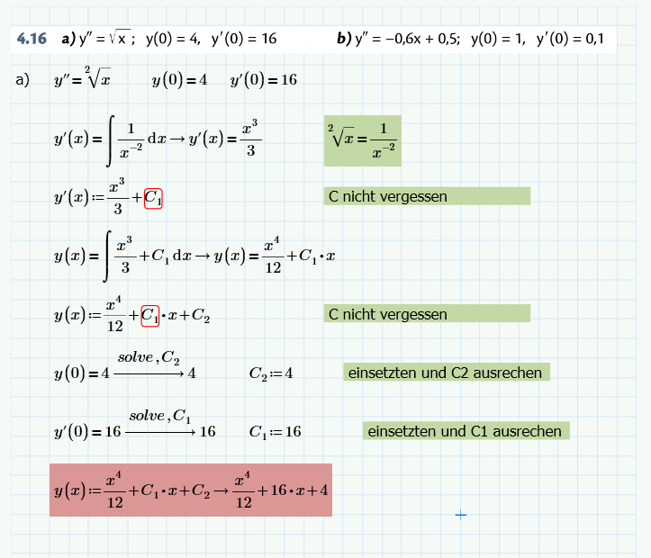
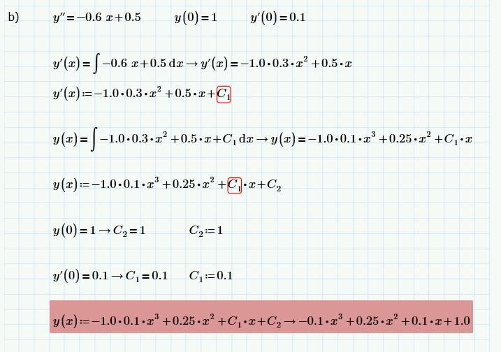
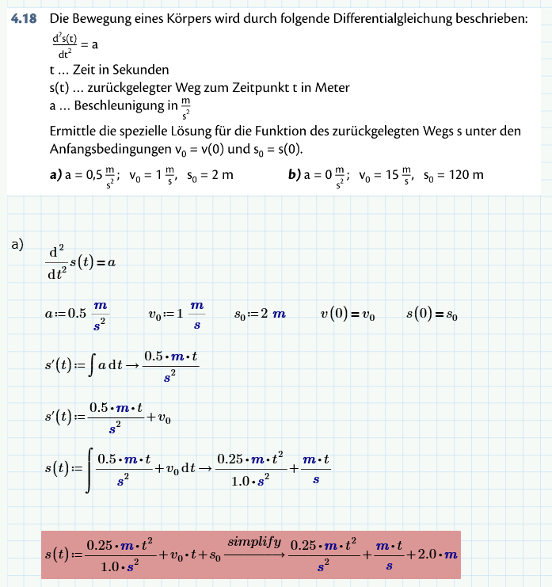
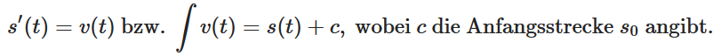
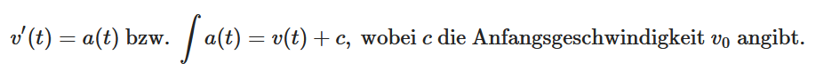
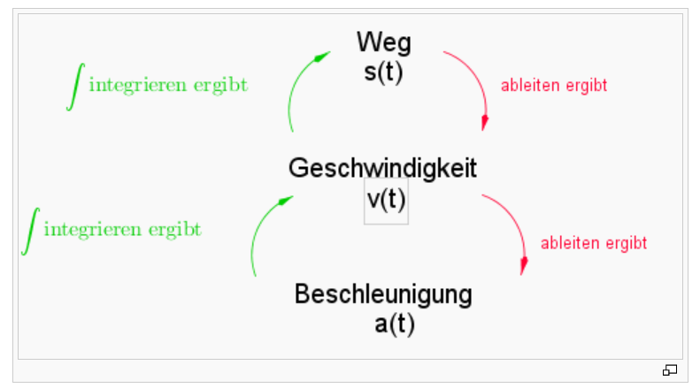
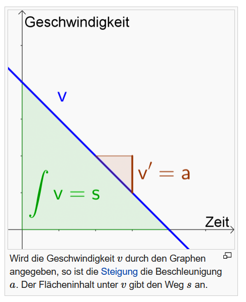

= Zweite Mathe Schularbeit

== Stoff

* Differentialgleichung

== Differentialgleichung (B.S.79)

=== Klassifizierung von Differentialgleichungen

.Theorie Differentialgleichung
====
image::images/image-2022-01-14-19-04-31-866.png[]

====

*Lineare Differentialgleichungen* sind Gleichungen bei denen die gesuchte Funktion
und ihre Ableitungen nur in der ersten Pontenz auftretten. In anderen Worten: *Keine Hochzahl*.

.Beispiel für *Lineare Differentialgleichungen*
====
image::images/image-2022-01-14-19-08-19-509.png[]
====

Hängt eine Differentialgleichung nur von *einer unabhängigen Variablen* ab, bezeichnet man sie als _gewöhnliche Differentialgleichung_.
Kommen in einer Differentialgleichung jedoch Funktionen *in mehreren Variablen* vor, so spricht man von partiellen Differentialgleichungen.

.Beispiel gewöhnliche und partielle Differentialgleichung
====
image::images/image-2022-01-14-19-12-24-523.png[]
====

=== Lösen der Differentialgleichung

.Lösen der Differentialgleichung (B.S. 83)
====
image::images/image-2022-01-14-19-29-34-809.png[]
====

.Theorie Frage (B.S. 84)
====
image::images/image-2022-01-14-19-34-02-327.png[]
====

.Theorie Frage (B.S. 84)
====
image::images/image-2022-01-14-19-35-29-787.png[]
====

.Erkennen der Diferentialgleichung (B.S. 84)
====
image::images/image-2022-01-15-12-45-05-843.png[]
====

.Erkennen der Diferentialgleichung (B.S. 84)
====
image::images/image-2022-01-15-12-50-30-497.png[]
====

.Ermitteln der allgemeinen Lösung (B.S. 85)
====
image::images/image-2022-01-15-13-02-11-748.png[]
====

.Ermitteln der allgemeinen Lösung (B.S. 85)
====
image::images/image-2022-01-15-13-10-58-163.png[]
====

.Ermitteln der speziellen Lösung mit Physik (B.S. 85)
====

====

.Ermitteln der speziellen Lösung (B.S. 85)
====

====

IMPORTANT: Integration: Weg, Geschwindigkeit, Beschleunigung

* s(t) gibt den zurückgelegten Weg zum Zeitpunkt t an (Einheit: m oder km ...)
* v(t) gibt die Momentangeschwindigkeit zum Zeitpunkt t an (Einheit: m/s oder km/h ...). Die Geschwindigkeit ist die momentane Änderung des Weges s(t), d. h.
====

====

* a(t) gibt die Beschleunigung zum Zeitpunkt t an (Einheit: m/s2 oder km/h2 ...). Die Beschleunigung ist die momentane Änderung der Geschwindigkeit v(t), d. h.

====

====

*Vereinfacht gesagt gilt folgender Zusammenhang:*

====

====
