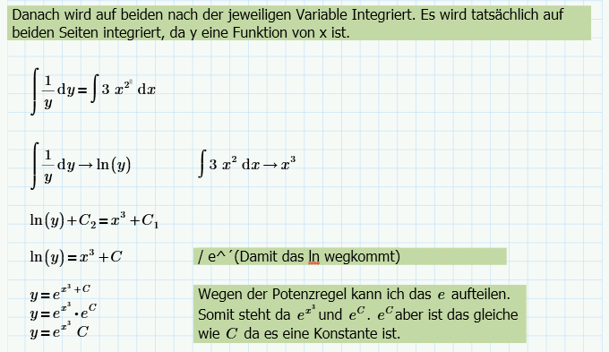

= Zweite Mathe Schularbeit

== Stoff

* Differentialgleichung
* Trennen der Variablen

== Differentialgleichung (B.S.79)

=== Klassifizierung von Differentialgleichungen

.Theorie Differentialgleichung
====
image::images/image-2022-01-14-19-04-31-866.png[]

====

*Lineare Differentialgleichungen* sind Gleichungen bei denen die gesuchte Funktion
und ihre Ableitungen nur in der ersten Pontenz auftretten. In anderen Worten: *Keine Hochzahl*.

.Beispiel für *Lineare Differentialgleichungen*
====
image::images/image-2022-01-14-19-08-19-509.png[]
====

Hängt eine Differentialgleichung nur von *einer unabhängigen Variablen* ab, bezeichnet man sie als _gewöhnliche Differentialgleichung_.
Kommen in einer Differentialgleichung jedoch Funktionen *in mehreren Variablen* vor, so spricht man von partiellen Differentialgleichungen.

.Beispiel gewöhnliche und partielle Differentialgleichung
====
image::images/image-2022-01-14-19-12-24-523.png[]
====

=== Lösen der Differentialgleichung

.Lösen der Differentialgleichung (B.S. 83)
====

====

.Theorie Frage (B.S. 84)
====
image::images/image-2022-01-14-19-34-02-327.png[]
====

.Theorie Frage (B.S. 84)
====

====

.Erkennen der Diferentialgleichung (B.S. 84)
====
image::images/image-2022-01-15-12-45-05-843.png[]
====

.Erkennen der Diferentialgleichung (B.S. 84)
====
image::images/image-2022-01-15-12-50-30-497.png[]
====

.Ermitteln der allgemeinen Lösung (B.S. 85)
====

====

.Ermitteln der allgemeinen Lösung (B.S. 85)
====
image::images/image-2022-01-15-13-10-58-163.png[]
====

.Ermitteln der speziellen Lösung (B.S. 85)
====
image::images/image-2022-01-15-17-27-37-460.png[]
image::images/image-2022-01-15-17-42-12-812.png[]
====

.Ermitteln der speziellen Lösung mit Physik (B.S. 85)
====

====

IMPORTANT: Integration: Weg, Geschwindigkeit, Beschleunigung

* s(t) gibt den zurückgelegten Weg zum Zeitpunkt t an (Einheit: m oder km ...)
* v(t) gibt die Momentangeschwindigkeit zum Zeitpunkt t an (Einheit: m/s oder km/h ...). Die Geschwindigkeit ist die momentane Änderung des Weges s(t), d. h.
====
image::images/image-2022-01-15-20-41-27-335.png[]
====

* a(t) gibt die Beschleunigung zum Zeitpunkt t an (Einheit: m/s2 oder km/h2 ...). Die Beschleunigung ist die momentane Änderung der Geschwindigkeit v(t), d. h.

====
image::images/image-2022-01-15-20-42-30-403.png[]
====

*Vereinfacht gesagt gilt folgender Zusammenhang:*

====
image::images/image-2022-01-15-20-43-09-813.png[]

====

== Trennen der Variablen (B.S. 86)

=== Erklärungsbeispiel

Kann eine Differentialgleichung 1. Ordnung auf die Form ``y' = f(x) * g(x)`` gebracht werden,
so kann deren Lösungsweg mit *Trennen der Variablen* werden.

Dabei ist *y* eine Funktion in Abhängigkeit von *x*.

.Lösen einer Differentialgleichung mit Trennen der Variablen
====

====

.Lösen einer Differentialgleichung mit Trennen der Variablen (B.S. 87)
====

====

.Lösen einer Differentialgleichung mit Trennen der Variablen (B.S. 87)
====

====

.Kodensator
====

image::images/image-2022-01-16-21-33-42-631.png[]
====

== Ausgleichsrechnung

Daten liegen oft in Form von Wertepaaren vor. Mithilfe der Ausgleichsrechnung werden die
Parameter einer Funktion von vorgegebenem Typ so bestimmt, dass der Funktionsgraph sich den
erhobenen Datenpunkten am besten anpasst.

Die Stärke des Zusammenhangs zwischen den beiden Größen wird mithilfe der Korrelation beschrieben.

In anderen Worten: Die Korrelation zeigt an wie nahe die Punkte bei dem Graphen sind.

.Punktwolken-Diagramm
====

====

== Lineare Regression und Korrelation

.Korrelation
====

====

.Lineare Regression (B.S. 271)
====

*Wichtig* bei der funktion unten wird das k mit x ersetzt. Hab mich vertippt.
====

.Exponentiele Regression (B.S. 273)
====

====

.Logaritmische Regression (B.S. 275) credit ganesha
====

====

.Alle Regressionen (B.S. 273)
====

====

.Quadratische (B.S. 273)
====

====
